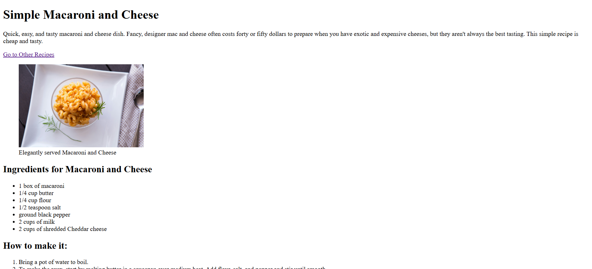

# 📁 Mac & Cheese Recipe

## ℹ️ a basic recipe website using only HTML

A pure HTML website built as part of my earliest lessons in frontend development.

---

## 🔍 Overview

This project is a single-page recipe site built with **HTML5 only**. It displays a simple but structured layout for a classic _Macaroni and Cheese_ recipe using semantic tags like `<header>`, `<main>`, `<article>`, and `<footer>`.

I included navigation links, a featured image with a caption, and organized the ingredients and cooking steps using HTML lists and sections. The project helped me learn how to build and present structured content without any CSS or JavaScript.

---

## 🧠 What I Learned

- How to write clean, semantic HTML from scratch
- Structuring content using `<article>`, `<aside>`, and `<section>`
- Using `<ul>` and `<ol>` for lists
- Creating simple navigation with anchor links
- Adding images and captions with `<figure>` and `<figcaption>`
- Writing meta tags for SEO and Open Graph previews
- Linking internally and externally using relative paths

---

## 🛠️ Tech Used

- HTML5

---

## 🚀 How to Run

1. Clone the repository
2. Navigate to this project folder
3. Open `index.html` in your browser

---

## 🌐 Live Demo

Or you can check out the 👉 [live website here](https://beginner-portfolio-website.netlify.app/html5%20projects/project%201/)

---

## 🧑‍💻 Author

Created by **Elmar Chavez**

🗓️ Month/Year: **April 2025**

📚 Journey: **First month** of learning _frontend web development_.
